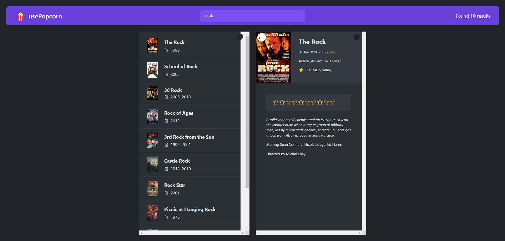
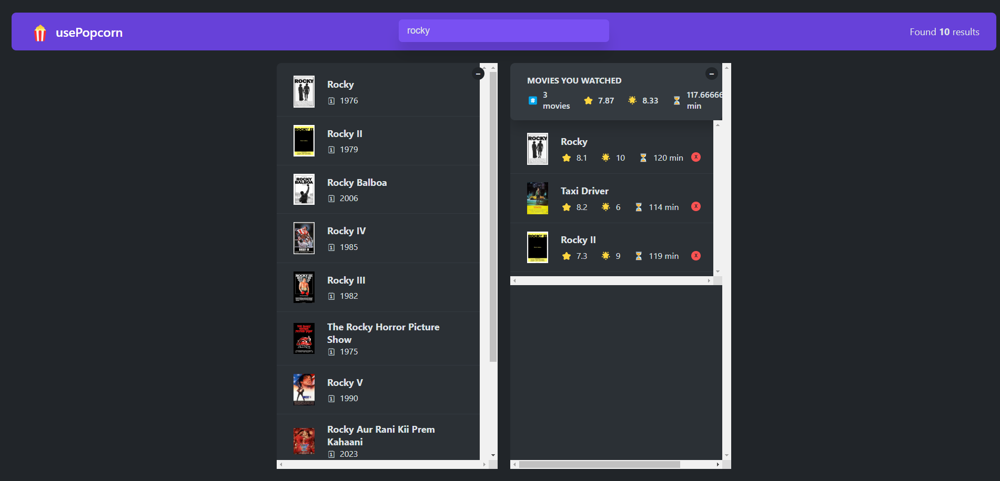

# React Popcorn: Movie Rating and Watchlist Application

You can see web app here: [Live Demo](https://npopcoorn.netlify.app/) 
###!IMPORTANT - Due to the api bugs, this project might not work fine. You can check wanted version on this link: [Live Demo](https://usepopcorn.netlify.app/)

## Project Description
React Popcorn is a modern movie rating and watchlist application built to provide users with a seamless experience in discovering, rating, and organizing their favorite movies. With a user-friendly interface and dynamic features, the application showcases practical usage of React for building interactive applications.

---

## Features
- **Search Movies**: Search for movies using an integrated API.
- **Add to Watchlist**: Save movies to a personalized watchlist.
- **Rate Movies**: Rate and review movies for future reference.
- **Responsive Design**: Optimized for use across all devices.
- **Dynamic Updates**: Reflects real-time changes in watchlist and ratings.

---

## Technologies Used
- **React**: Core framework for building the user interface.
- **CSS3**: For styling and responsive layouts.
- **TMDB API**: For fetching movie data.
- **Netlify**: For hosting and deployment.

---

## Setup Instructions
To run this project locally, follow these steps:

1. Clone the repository:

   ```bash
   git clone https://github.com/AndNijaz/React-Popcorn.git
   ```

2. Navigate to the project directory:

   ```bash
   cd React-Popcorn
   ```

3. Install dependencies:

   ```bash
   npm install
   ```

4. Start the development server:

   ```bash
   npm start
   ```

5. Open `http://localhost:3000` in your browser to view the application.

---

## Usage
The application is designed for:
- **Movie Enthusiasts**: Discovering and organizing movies.
- **Casual Users**: Maintaining a simple watchlist and rating system.
- **Developers**: Exploring a React-based project structure.

---

## Screenshots

### Search Movies


### Watchlist


> *Screenshots are stored in the `/img` directory.*

---

## Project Status
This project is currently **complete**. Future updates may include:
- Adding a user authentication system for saving personalized watchlists.
- Expanding features to include TV shows and trending categories.
- Integrating social sharing options for watchlists and reviews.

---

## Acknowledgements
This project is inspired by a passion for movies and a desire to explore React's capabilities in creating interactive web applications. Special thanks to the contributors and users for their feedback and support.

---

## License
This project is licensed under the [MIT License](LICENSE).
